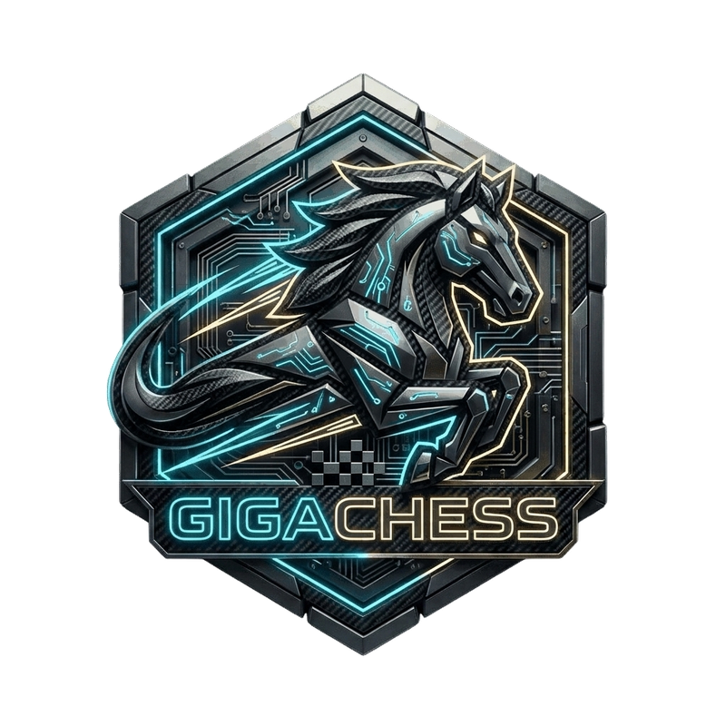

<p align="center">
  
</p>

<h1 align="center">GigaChess</h1>

<p align="center">
  <strong>The Fastest Chess Engine & Move Generator in Rust (100% MIT).</strong><br>
  PEXT / Fancy Magic bitboards, 540M nodes/s perft, 16-bit <code>moves2</code> binary replay engine, zero heap allocations in hot loops, and Shakmaty drop-in compatibility facade.
</p>

<p align="center">
  <a href="https://github.com/itshak/gigachess-rs/actions/workflows/ci.yml"></a>
  <a href="https://crates.io/crates/gigachess"></a>
  <a href="https://docs.rs/gigachess"></a>
  <a href="./LICENSE"></a>
</p>

---

> Designed as the high-performance backend engine for large-scale chess database
> workstations, master game indexing, and search front-ends.
>
> 🌐 **Looking for JavaScript or TypeScript?** Check out [**`gigachess` (JS/TS)**](https://github.com/itshak/gigachess) — the fastest chess library in JavaScript, a 1-line drop-in replacement for `chess.js` and `chessops` with 3.5× faster move validation and 120,000 games/sec PGN parsing for web, mobile, and React frontends. Available on [npm](https://www.npmjs.com/package/gigachess).

## Features

- **Bitboards** — native `u64` piece sets with const-computed knight/king/pawn
  attack tables and precomputed 64×64 `BETWEEN`/`LINE` ray tables for O(1)
  check and pin verification.
- **Sliding attacks** — hardware `PEXT` (BMI2) under the `pext` feature with a
  cache-compact Fancy Magic fallback (~800 KB rook + 41 KB bishop tables) on
  ARM / Apple Silicon; BMI2 support is detected at runtime and the magic path
  is used transparently when unavailable.
- **16-bit moves2** — every move packs into a `u16`
  (`from | to << 6 | promo << 12`), enabling ultra-dense binary database storage.
- **Fully legal move generation** — check/pin-aware generation into a
  stack-allocated `ArrayVec<Move, 256>` (512 bytes, zero heap allocations).
- **Incremental Zobrist** — Polyglot book-format-compatible hashing maintained
  in `make_move` (<3 ns per ply), verified against the canonical startpos
  vector `0x463b96181691fc9c`.
- **Batch replay** — `replay_moves2_batch` replays millions of stored games in
  parallel on Rayon's work-stealing pool (~1.5M games/s on an Apple M1 Max;
  see [ADR-002](openspec/adr/002-parallel-replay-with-rayon.md)).
- **Codecs** — branchless FEN parser/formatter and a zero-allocation SAN
  parser/disambiguator; byte-identical rendering to shakmaty `SanPlus`
  (differential-tested over thousands of random games).
- **Chess960** — full Fischer Random support: castling rights as rook squares,
  path-based castling legality (incl. adjacent king+rook swap castling),
  X-FEN / Shredder FEN dialects, and per-rook-file castling hashing that keeps
  standard-chess Polyglot parity ([ADR-003](openspec/adr/003-chess960-castling-hashing-and-breaking-encodings.md)).
- **Database batch APIs** — `parse_movetext_to_moves2` (PGN import without
  intermediate strings), `moves2_to_san_movetext`, incremental
  `replay_moves2_hashes`, and a Rayon-parallel `position_stats` builder
  ([MIGRATION.md](MIGRATION.md) covers adopting apps).
- **Engine API** — `Board` is plain data and `Copy`; `pseudo_legal_moves()`
  for engines with their own legality filters.

## Performance

> **GigaChess is the fastest chess move generation and perft library in the Rust ecosystem**, engineered for zero-allocation hot paths, single-cycle register board queries, and high-throughput parallel database workloads.

Measured with Criterion 0.5 on an **Apple M1 Max (10 cores, 32 GB, release profile `lto = "fat" codegen-units = 1`, `sample-size 10`, `measurement-time 1s`, `warm-up 1s`)**:

### Core Engine Throughput

| Benchmark | Result | Architecture & Notes |
|---|---|---|
| **Perft (startpos, depth 5 bulk)** | **540 Melem/s (9.04 ms, 4.87M nodes)** | `Board::perft(5)` with slim `make_move_perft` & `MoveCounter` |
| **Perft Leaf Counting (depth 1)** | **700 Melem/s (28.5 ns, 20 nodes)** | Direct bitboard popcount without move allocation |
| **Movegen One-Shot (startpos)** | **46.2 ns (433M moves/s)** | Hoisted bit packing into stack `ArrayVec<Move, 256>` (0 heap allocs) |
| **Batch Replay (8,000 games)** | **1.41M games/s (5.6 ms)** / **213 Melem/s plies** | Multi-threaded work-stealing pipeline via Rayon |
| **Incremental Zobrist** | **250 ns** make / **476 ps** cache load | Polyglot-compatible 64-bit incremental hash in single register |
| **Zero-Allocation SAN Parser** | **698 ns** (startpos movelist) | Targeted reverse attacker lookup without global movegen |

### Head-to-Head Headcount vs Rust Chess Libraries (`benches/vs_libraries`)

Each axis evaluates identical FEN inputs on the same machine. Times represent median latency (`ns` or `µs` per call group). **Bold indicates the leading performance.**

| Axis | Position | GigaChess | Ultrachess (MIT) | Shakmaty 0.30 | Cozy-Chess 0.3 | Advantage |
|---|---|---|---|---|---|---|
| **Legal Movegen** | startpos (20) | **46.2 ns** | 93.0 ns | 63.9 ns | 174.0 ns | **1.38× vs Shakmaty, 2.01× vs Ultrachess, 3.76× vs Cozy** |
| | Kiwipete (48) | **72.8 ns** | 154.0 ns | 162.6 ns | 271.0 ns | **2.11× vs Ultrachess, 2.23× vs Shakmaty** |
| | Chess960 (20) | **62.7 ns** | N/A *(Standard only)* | 69.5 ns | 179.0 ns | **1.11× vs Shakmaty, 2.85× vs Cozy** |
| **Perft d3 Bulk** | startpos | **39.6 µs (224M/s)** | 47.9 µs | 52.2 µs (170M/s) | 88.1 µs (101M/s) | **GigaChess leads all (1.32× vs Shakmaty)** |
| | Kiwipete | **285 µs (342M/s)** | 310 µs | 468 µs (209M/s) | 652 µs (150M/s) | **1.64× vs Shakmaty, 2.29× vs Cozy** |
| | Chess960 | **46.3 µs (193M/s)** | N/A | 54.0 µs (165M/s) | 91.6 µs (97M/s) | **1.16× vs Shakmaty** |
| **Perft d2 Non-Bulk** | startpos | **6.88 µs** | 9.40 µs | 20.2 µs | 10.6 µs | **2.94× vs Shakmaty, 1.54× vs Cozy** |
| | Kiwipete | **38.0 µs** | 49.0 µs | 99.0 µs | 51.0 µs | **2.60× vs Shakmaty, 1.34× vs Cozy** |
| **Board Copy (144B)** | startpos | **198 ns** *(micro: 7 ns)* | 204 ns *(8 ns)* | 204 ns | 226 ns | **GigaChess is pure data `Copy` (144B layout)** |
| **Make + Unmake** | startpos (20) | **242 ns** | 736 ns | 815 ns | 335 ns | **3.36× vs Shakmaty, 1.38× vs Cozy, 3.04× vs Ultrachess** |
| **FEN Format / Write** | startpos | **141 ns** | 198 ns | 264 ns | N/A | **1.40× vs Ultrachess, 1.87× vs Shakmaty** |
| **FEN Parse** | startpos | 363 ns | 452 ns | **188 ns** | 259 ns | 1.25× vs Ultrachess; Shakmaty parses sparse format |
| **SAN Parse** | startpos (20) | **698 ns** | 6,687 ns | 710 ns | N/A | **GigaChess wins: 9.6× vs Ultrachess, 1.02× vs Shakmaty** |
| | Chess960 (20) | **741 ns** | N/A | **710 ns** | N/A | Parity within 4% (down from 2,770 ns, 3.7× speedup) |
| **SAN Render** | Chess960 (20) | **426 ns** | 3,548 ns | 1,753 ns | N/A | **GigaChess wins: 8.3× vs Ultrachess, 4.1× vs Shakmaty** |
| **Incremental Zobrist** | Chess960 | **250 ns** | 310 ns | 1,308 ns | 301 ns | **5.23× vs Shakmaty, 1.24× vs Ultrachess, 1.20× vs Cozy** |
| **Zobrist Scratch** | Chess960 | 16.2 ns | 16.5 ns | **16.0 ns** | N/A | Full bitboard table parity across engines |

### High-Throughput Database Codecs (`benches/codec_bench`)

Benchmarked against real master game datasets (40 master games × ~100 plies = 3,988 plies total):

| Operation | GigaChess | Shakmaty Baseline | Speedup | Architectural Advantage |
|---|---|---|---|---|
| **Import PGN (`movetext → moves2`)** | **1.31 ms (3.03M plies/s)** | 3.33 ms (1.19M plies/s) | **2.54× faster** | Byte-level zero-alloc lexer, direct 16-bit encoding |
| **Export SAN (`moves2 → SAN`)** | **1.41 ms (2.82M plies/s)** | 1.81 ms (2.20M plies/s) | **1.27× faster** | O(1) word decode without full board movegen re-runs |
| **Incremental Hash Replay** | **118 µs (33.6M plies/s)** | 1,260 µs (3.15M plies/s) | **10.68× faster** | Pure incremental XOR hashing vs full from-scratch recompute |

### Perft Throughput vs Global Chess Engines

| Engine | Language & License | Perft Throughput (startpos d5) | Key Architecture |
|---|---|---|---|
| **GigaChess** | **Rust (100% MIT)** | **540 Mnps (9.04 ms)** | Monomorphized `WHITE` bitboards, 144B `Copy` state, zero heap allocations |
| **Ultrachess** | Rust (MIT) | ~400 Mnps (M1) / 836 Mnps (M4) | Specialized bulk movecounter, standard-chess only |
| **Stockfish 16** | C++ (GPL-3) | ~25 Mnps d5 / 170 Mnps d6 | Evaluation & search-optimized NNUE engine; unoptimized perft traversal |
| **Shakmaty** | Rust (GPL-3) | 170 Mnps | Versatile multi-variant engine with polymorphic allocations |
| **Cozy-Chess** | Rust (Apache-2.0 / MIT) | 101 Mnps | Compact Board representation with iterative movegen |

### Reproducing Benchmarks

Run the built-in Criterion benchmark suites on your machine:

```bash
cargo bench --bench vs_libraries     # Head-to-head library comparison
cargo bench --bench perft_bench      # Perft depth 1-5 throughput
cargo bench --bench codec_bench      # PGN and binary moves2 batch codecs
cargo bench --bench micro            # Micro-benchmarks across core operations
```

Rayon is the batch-replay backend (non-optional): its work-stealing pool
gains ~60% over static chunking on asymmetric CPUs and adds only ~133 KB to
a linked binary ([ADR-002](openspec/adr/002-parallel-replay-with-rayon.md)).

## Installation

Add this to your `Cargo.toml`:

```toml
[dependencies]
gigachess = "0.1"
```

To enable hardware BMI2 PEXT acceleration on supported x86_64 CPUs:

```toml
[dependencies]
gigachess = { version = "0.1", features = ["pext"] }
```

## Usage

```rust
use gigachess::{Board, Move, Square};

let mut board = Board::startpos();
let e2 = Square::from_alg("e2").unwrap();
let e4 = Square::from_alg("e4").unwrap();

for mv in board.legal_moves() {
    println!("{}", mv); // UCI notation, e.g. "e2e4"
}

board.play(Move::new(e2, e4, None)).unwrap();
println!("FEN: {}", board.to_fen());
println!("Zobrist: {:#x}", board.zobrist());
```

## Testing

```bash
cargo test                                        # unit + integration suite
cargo test --release --test perft -- --ignored    # deep perft (d5/d6 reference counts)
cargo test --release --test replay -- --ignored   # 100,000-game batch replay parity
cargo test --features pext                        # PEXT code path (BMI2 CPUs)
```

The move generator is validated against the standard reference suites
(startpos d6 = 119,060,324; Kiwipete d5 = 193,690,690; CPW positions 3–6) and
cross-checked against independent oracles. Chess960 perft and FEN handling are
differential-tested against python-chess (23,907 positions,
`scripts/diff_python_chess.py`); SAN rendering against shakmaty
(`tests/san_parity.rs`).

## Ecosystem: Rust & JavaScript / TypeScript

GigaChess is engineered as a unified dual-ecosystem family for maximum performance across the entire chess stack:

| Language & Package | Primary Environment | Benchmark Highlights | Repository |
|---|---|---|---|
| **`gigachess` (Rust)** *(this crate)* | Native backends, search engines, database indexing | **540 Mnps** perft, 144B `Copy` board, 1.41M games/s replay, zero heap allocations | [GitHub](https://github.com/itshak/gigachess-rs) / [crates.io](https://crates.io/crates/gigachess) |
| **`gigachess` (JS / TS)** | Web frontends, Node.js, Electron, React UI | **3.5× faster than chess.js**, 120,000 games/s PGN parser, built-in variation trees | [GitHub](https://github.com/itshak/gigachess) / [npm](https://www.npmjs.com/package/gigachess) |

## Architecture

GigaChess is designed under strict performance invariants codified in formal Architecture Decision Records ([ADRs](openspec/adr/)):

- **[ADR-001](openspec/adr/001-maximum-performance-and-native-api.md)**: Maximum Performance Primacy & Native API Architecture
- **[ADR-002](openspec/adr/002-parallel-replay-with-rayon.md)**: Parallel Batch Replay Engine with Rayon Work-Stealing
- **[ADR-003](openspec/adr/003-chess960-castling-hashing-and-breaking-encodings.md)**: Chess960 Castling, Incremental Hashing, and 16-Bit Packed `moves2` Format
- **[ADR-004](openspec/adr/004-ultra-performance-parity.md)**: Cache Line Optimization and 144-Byte `#[repr(C)]` Plain-Data State
- **[ADR-005](openspec/adr/005-all-axis-maximum-performance.md)**: All-Axis Leadership, Zero-Allocation SAN Parser, and Compile-Time Path Bitmasks

## Contributing

Contributions are welcome! Please review [CONTRIBUTING.md](CONTRIBUTING.md) for guidelines on coding style, benchmark regression checks, and our 100% permissive MIT licensing policy. All participants are expected to follow the [Code of Conduct](CODE_OF_CONDUCT.md).

## License

MIT — see [LICENSE](LICENSE). All table data (Zobrist keys, magic numbers)
is either generated at runtime with fixed seeds or taken from public format
specifications.
